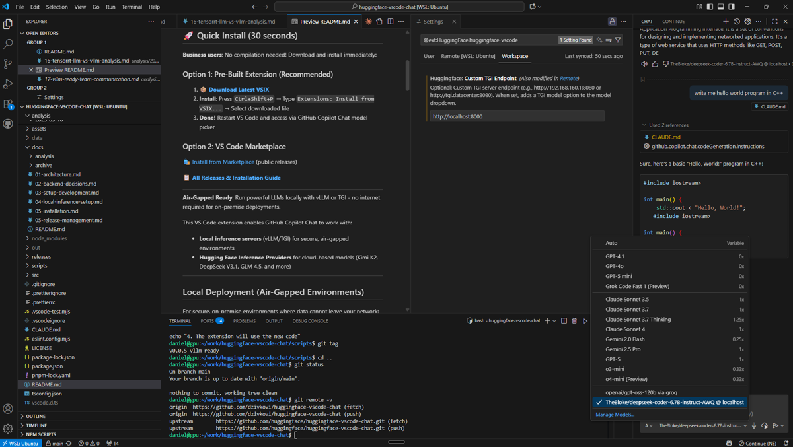

# vLLM HuggingFace Bridge for GitHub Copilot

[](https://github.com/dzivkovi/vllm-huggingface-bridge/releases/latest)
[](LICENSE.txt)
[](https://code.visualstudio.com/)

**Bridge GitHub Copilot with local vLLM/TGI servers and HuggingFace cloud models**

## 🚀 Quick Install

### Option 1: Download Latest Release (Recommended)
1. **[⬇️ Download v1.0.0 VSIX](https://github.com/dzivkovi/vllm-huggingface-bridge/releases/download/v1.0.0/vllm-huggingface-bridge-1.0.0.vsix)** (92KB)
2. **Install in VS Code**:
   - Press `Ctrl+Shift+P` (or `Cmd+Shift+P` on macOS)
   - Type `Extensions: Install from VSIX...`
   - Select the downloaded `.vsix` file
3. **Restart VS Code** and select models in GitHub Copilot Chat

### Option 2: Command Line Install
```bash
# Download and install in one command
wget https://github.com/dzivkovi/vllm-huggingface-bridge/releases/download/v1.0.0/vllm-huggingface-bridge-1.0.0.vsix
code --install-extension vllm-huggingface-bridge-1.0.0.vsix
```

### Uninstall Previous Versions
```bash
# Remove original HuggingFace extension if installed
code --uninstall-extension HuggingFace.huggingface-vscode-chat

# Remove old vLLM Community version if installed
code --uninstall-extension vllm-community.vllm-huggingface-bridge
```

## ✨ Features

- **🔒 Air-Gapped Ready**: Complete offline operation with local vLLM/TGI servers
- **🚀 Dual Mode**: Seamlessly switch between local and cloud models
- **⚡ Optimized**: 92KB package size (91% smaller than original)
- **🛡️ Enterprise Ready**: Production-tested in secure environments
- **🔧 Zero Config**: Works out-of-the-box with sensible defaults
- **📊 Smart Token Management**: Automatic allocation for small context models

## Local Deployment (Air-Gapped Environments)

For secure, on-premise environments where data cannot leave your network:

1. Start your local vLLM or TGI server (see setup instructions below)
2. Configure VS Code settings: `"huggingface.localEndpoint": "http://your-server:8000"`
3. Select your local model from the GitHub Copilot Chat model picker
4. **No API keys required, all processing stays on your infrastructure**



## Cloud Deployment (Hugging Face)
1. **Install the extension**: [📦 Download VSIX](./releases/vllm-huggingface-bridge-latest.vsix)
2. Open VS Code's chat interface.
3. Click the model picker and click "Manage Models...".
4. Select "Hugging Face" provider.
5. Provide your Hugging Face Token, you can get one in your [settings page](https://huggingface.co/settings/tokens/new?ownUserPermissions=inference.serverless.write&tokenType=fineGrained). You only need to give it the inference.serverless permissions.
6. Choose the models you want to add to the model picker. 🥳

## Local vLLM/TGI Server Setup

**Production Ready**: Successfully deployed in enterprise air-gapped environments.

### Benefits of Local Inference:
- **Data Security**: All data remains on your infrastructure
- **Air-Gapped Operation**: No internet connectivity required
- **Low Latency**: Direct connection to local GPU servers
- **Cost Control**: No per-token API charges
- **Compliance**: Meet strict data residency requirements

### vLLM Setup (Recommended):
```bash
# Start vLLM (tested with RTX 4060, 8GB VRAM, DeepSeek-Coder 6.7B)
docker run -d --name vllm-server \
  --gpus all \
  --shm-size=4g \
  --ipc=host \
  -p 8000:8000 \
  vllm/vllm-openai:latest \
  --model TheBloke/deepseek-coder-6.7B-instruct-AWQ \
  --quantization awq \
  --gpu-memory-utilization 0.85
```

### Configure VS Code:
```json
// .vscode/settings.json
{
  "huggingface.localEndpoint": "http://localhost:8000",

  // CRITICAL for small context models (2048 tokens):
  "github.copilot.chat.editor.temporalContext.enabled": false,
  "github.copilot.chat.edits.temporalContext.enabled": false,
  "github.copilot.chat.edits.suggestRelatedFilesFromGitHistory": false
}
```

### ⚠️ Token Limit Considerations:
- **2048 context models ARE usable** with the settings above
- vLLM adds ~500 tokens for chat template formatting
- Extension automatically adjusts token allocation
- Responses limited to 50-100 tokens when near limits
- **For best experience**: Use 8K+ context models

## Why Use This Extension
* Access [SoTA open-source LLMs](https://huggingface.co/models?pipeline_tag=text-generation&inference_provider=cerebras,together,fireworks-ai,nebius,novita,sambanova,groq,hyperbolic,nscale,fal-ai,cohere,replicate,scaleway,black-forest-labs,ovhcloud&sort=trending) with tool calling capabilities.
* Single API to switch between multiple providers: Cerebras, Cohere, Fireworks AI, Groq, HF Inference, Hyperbolic, Nebius, Novita, Nscale, SambaNova, Together AI, and more. See the full list of partners in the [Inference Providers docs](https://huggingface.co/docs/inference-providers/index#partners).
* Built for high availability (across providers) and low latency.
* **Local Inference Support**: Run vLLM or TGI servers on-premise for air-gapped deployments
* Transparent pricing: what the provider charges is what you pay.

💡 The free Hugging Face user tier gives you a small amount of monthly inference credits to experiment. Upgrade to [Hugging Face PRO](https://huggingface.co/pro) or [Enterprise](https://huggingface.co/enterprise) for $2 in monthly credits plus pay-as-you-go access across all providers!

---

## Requirements
* VS Code 1.104.0 or higher.
* Hugging Face access token with `inference.serverless` permissions.

## 🛠️ Development
```bash
git clone https://github.com/huggingface/huggingface-vscode-chat
cd huggingface-vscode-chat
npm install
npm run compile
```
Press F5 to launch an Extension Development Host.

Common scripts:
* Build: `npm run compile`
* Watch: `npm run watch`
* Lint: `npm run lint`
* Format: `npm run format`
* Quick rebuild: `scripts/rebuild-extension.sh`
* Test vLLM: `scripts/test-vllm.sh`

📖 **For detailed guides**, see our [comprehensive documentation](docs/README.md)

---

## 🖥️ Using Local Inference Servers

This extension supports connecting to your own local inference servers for private model hosting.

### Recommended: vLLM Server (Docker Desktop)

#### Quick Start - Copy & Paste This Command:
```bash
docker run -d --name vllm-server \
  --gpus all \
  --shm-size=4g \
  --ipc=host \
  -p 8000:8000 \
  -v ~/.cache/huggingface:/root/.cache/huggingface \
  vllm/vllm-openai:latest \
  --model TheBloke/deepseek-coder-6.7B-instruct-AWQ \
  --quantization awq \
  --gpu-memory-utilization 0.85 \
  --max-model-len 2048 \
  --max-num-seqs 16 \
  --disable-log-stats
```

**⚠️ IMPORTANT: All flags are REQUIRED!**
- `--shm-size=4g` - Without this, vLLM crashes
- `--ipc=host` - Without this, GPU communication fails
- `--max-model-len 2048` - Without this, runs out of memory

#### VS Code Configuration:
1. Open Settings (Ctrl+,)
2. Search for "huggingface.localEndpoint"
3. Set value: `http://localhost:8000`
4. Reload VS Code

#### Docker Desktop Management:
- **Start**: Click ▶️ on container in Docker Desktop
- **Stop**: Click ⏹️ on container in Docker Desktop
- **Logs**: Click container name to view logs
- **Remove**: Stop first, then click 🗑️

#### Verify It's Working:
```bash
curl http://localhost:8000/v1/models
# Should return: TheBloke/deepseek-coder-6.7B-instruct-AWQ
```

**Full Setup Guide**: [vLLM Setup Guide](docs/06-setup-vllm.md)
**Model Selection**: [Choose models for your GPU](docs/08-model-selection-guide.md)

### Legacy: TGI Server
⚠️ **Deprecated due to stability issues**:

1. Open VS Code Settings (Ctrl+,)
2. Search for "huggingface.localEndpoint"
3. Enter your TGI server URL (e.g., `http://192.168.1.100:8080`)
4. See [TGI Setup Guide](docs/04-setup-tgi.md) for legacy support

---

## 📚 Learn more
* Inference Providers documentation: https://huggingface.co/docs/inference-providers/index
* VS Code Chat Provider API: https://code.visualstudio.com/api/extension-guides/ai/language-model-chat-provider
* TGI Documentation: https://huggingface.co/docs/text-generation-inference

---

## Support & License
* Open issues: https://github.com/huggingface/huggingface-vscode-chat/issues
* License: MIT License Copyright (c) 2025 Hugging Face
